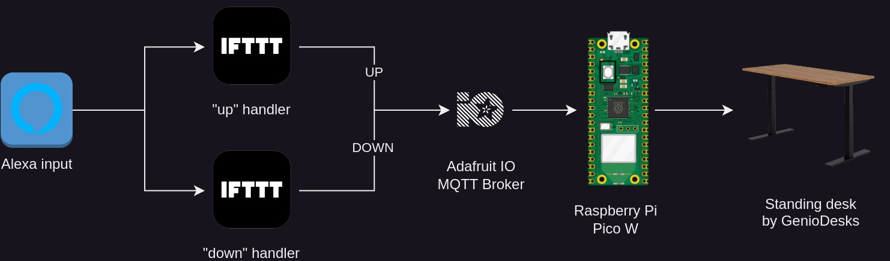
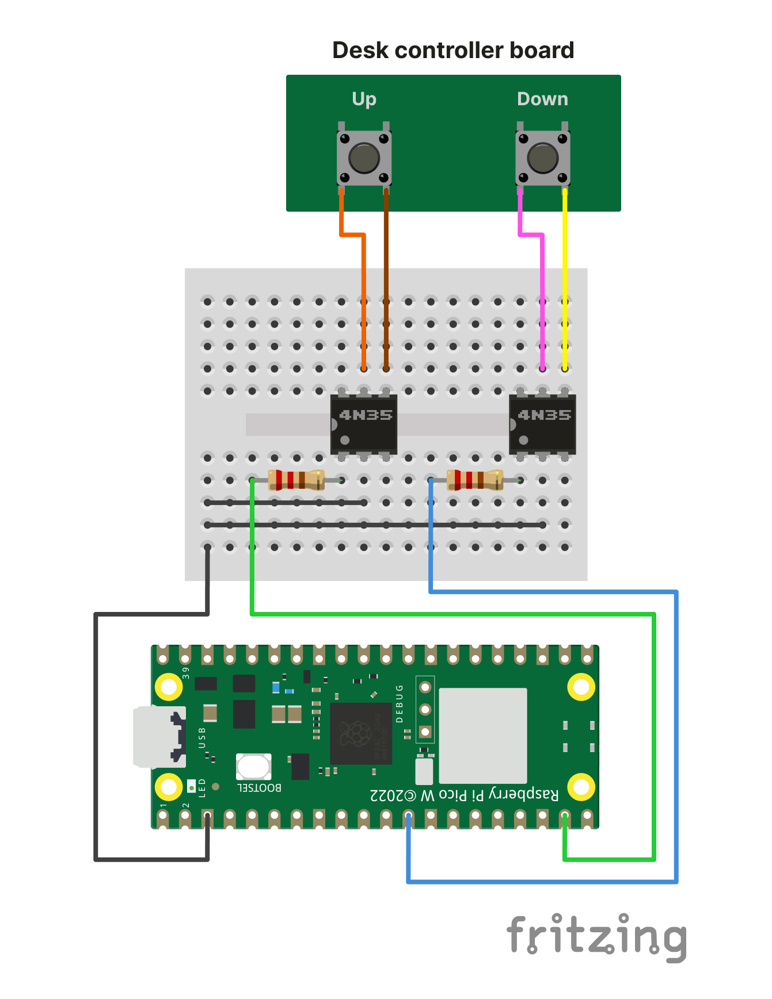

<!-- markdownlint-disable MD033 MD041 -->

  <h1 align="center">DIY Alexa-Automated Standing Desk</h1>

## Why

I LOVE my standing desk, it's been a game changer for my posture and for my setup aesthetics. However, I'm lazy and I don't like having to manually adjust its height. I also love my Echo Dot and I wanted to see if I could make my desk voice-controlled. This project is the result of that.

## How

It all starts by invoking the Alexa skill with the "subir a mesa" or "descer a mesa" intents, which are handled by the native IFTT integration. According to the received instruction, IFTT then sends a message ("UP" or "DOWN") to the Adafruit IO MQTT broker, whom then publishes the message to a specific topic that the Pico W is subscribed to.

When a message is received, the Pico W sends a signal to the corresponding 4n35 optocoupler, which is connected to the desk's pre-programmed up/down buttons. The optocoupler acts as a switch, closing the circuit and triggering the button press.

## Code

This project was built using the Pico W [Arduino](https://www.arduino.cc/en/software) Framework integration and the code is available in the `sketch` folder.

It's pretty straightforward, it just subscribes to the Adafruit IO MQTT broker and listens for messages, after connecting to the specified wifi network. When a message is received, it triggers the corresponding optocoupler.

I haven't tried it yet, but I think it should be pretty easy to make it work on the ESP32/ESP8266, since the code is pretty simple and the Adafruit IO MQTT library is compatible with both.

## BOM

- Pico W;
- 2x 4n35 Optocoupler;
- 2x 220Ω Resistor;
- Jumper wires;
- Breadboard/proof board;
- Patience;
